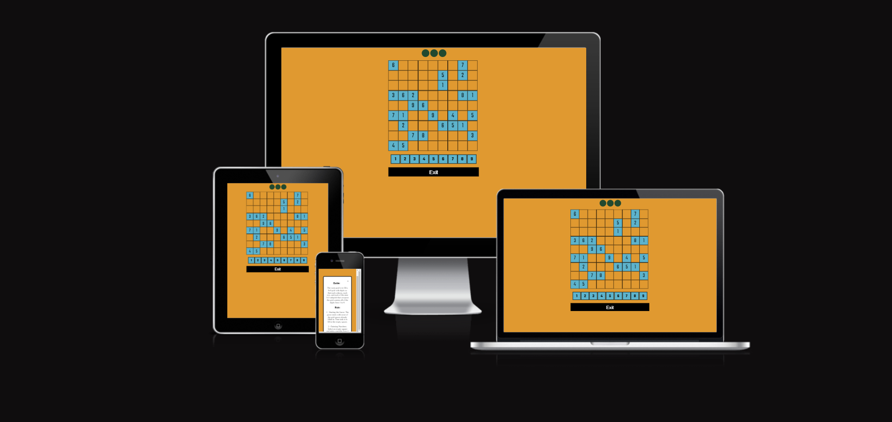
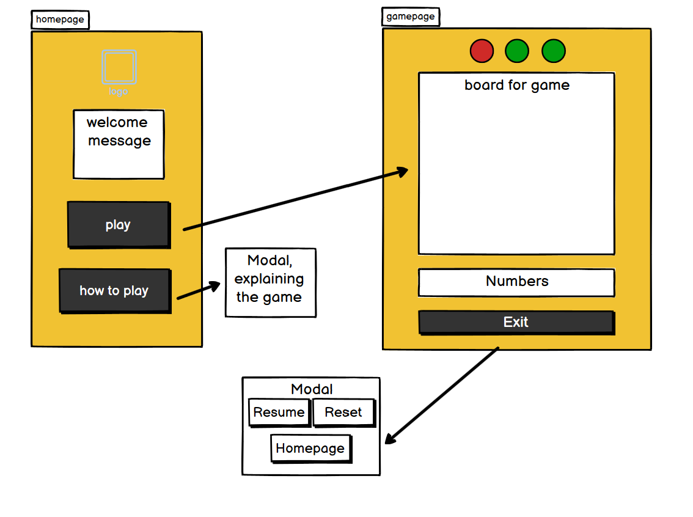
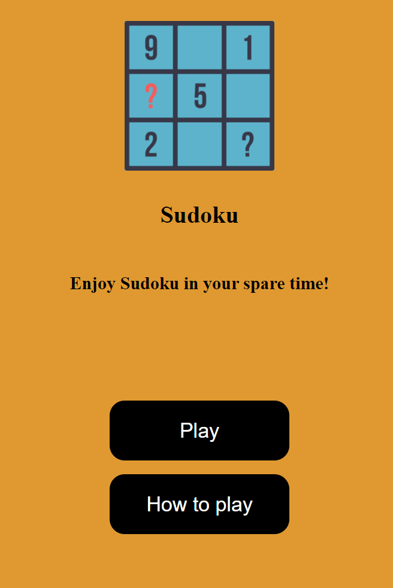
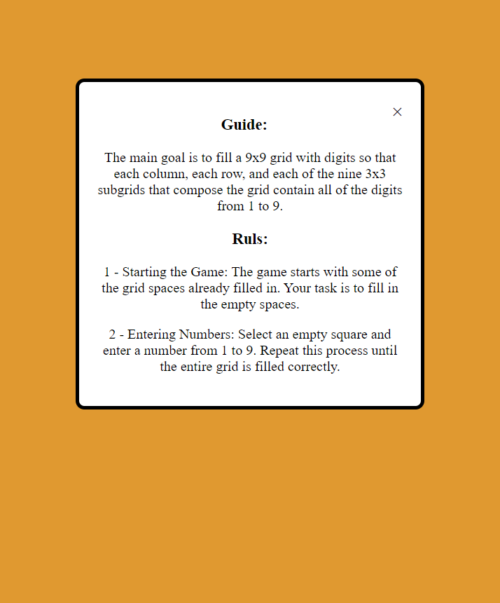
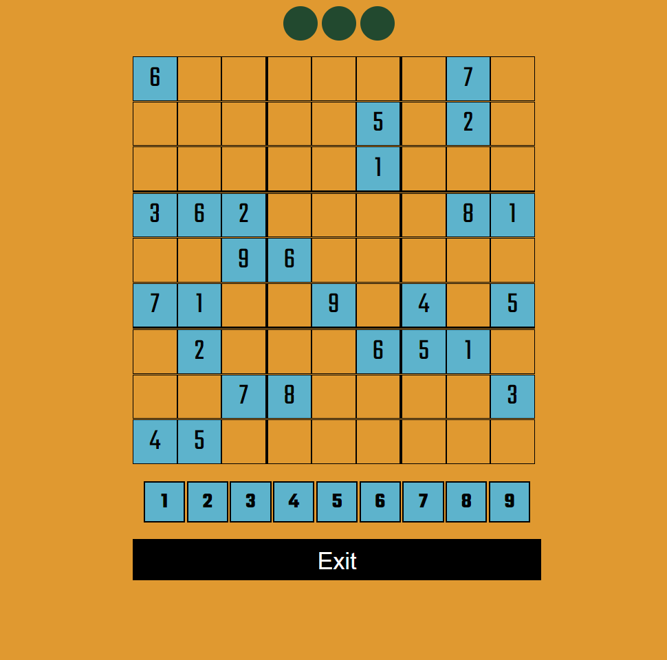
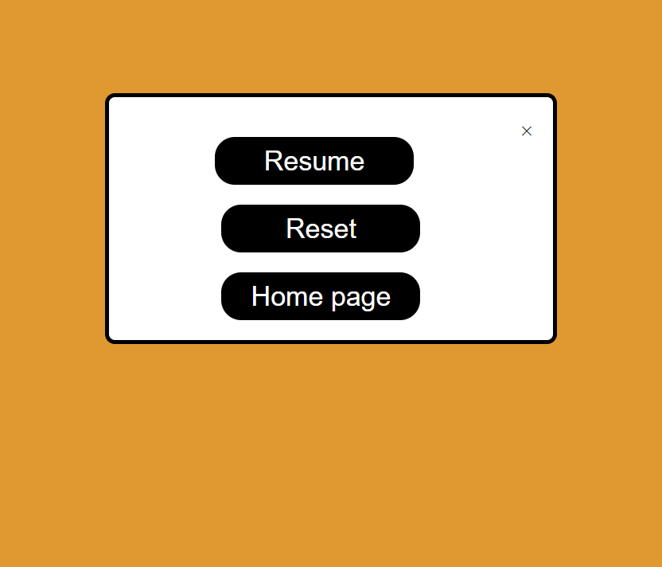

# Sudoku

## Code Institute - Second Milestone Project: JavaScript essentials Portfolio Project.

This website was developed to show my ability to work with javascrip and DOM.

Sudoku is a popular game that helps people keep their minds busy during their spare time.

# Table of Contents
- [Sudoku](#https://nkhanidev.github.io/sudoku/)
  - [Code Institute - Second Milestone Project: Javascript portfolio Project.](#code-institute---second-milestone-project-javascript-essentials-portfolio-project)
- [Table of Contents](#table-of-contents)
  - [Demo](#demo)
    - [A live demo to the website can be found here](#a-live-demo-to-the-website-can-be-found-here)
  - [UX](#ux)
  - [User stories](#user-stories)
    - [Strategy](#strategy)
    - [Scope](#scope)
    - [Structure](#structure)
    - [Skeleton](#skeleton)
  - [Technologies](#technologies)
  - [Features](#features)
    - [Existing Features](#existing-features)
    - [Features Left to Implement](#features-left-to-implement)
  - [Testing](#testing)
    - [Validator Testing](#validator-testing)
    - [Bugs](#bugs)
  - [Deployment](#deployment)
  - [Credits](#credits)
    - [Content](#content)
    - [Media](#media)
    - [Acknowledgements](#acknowledgements)

## Demo

### A live demo to the website can be found [here](https://nkhanidev.github.io/sudoku/)

## UX
The users are the players who are interested in playing the puzzle game.

## User stories
As a puzzle enthusiast who enjoys mental challenges, I want to access a variety of Sudoku puzzles online so that I can test my problem-solving skills and engage in cognitive exercises.

### Strategy
The ultimate goal is to find a digital Sudoku space that keeps users active during their downtime.

### Scope
- Gameplay: The core functionality would be to play Sudoku, likely with a digital grid where users can enter numbers.
- Instructions: Guidelines on how to play Sudoku, possibly with strategies or tips for newcomers.
- User Interaction: An interface that's easy to use, whether on desktop or mobile devices.

### Structure

**Website Sections:**
1. **_Home / Landing page:_** A simple welcome page allows users to navigate to the guide section and the game page.
2. **_Game page:_** Shows a simple interface that allows users to select the number and add it to the board.

The website is designed to be clear and simple. 

### Skeleten
The wireframe creation utilized Balsamiq.
My wireframe design:

### Color palette
Colors have been used in this projectL

## Technologies
1. HTML - To create a basic site
2. CSS - To create a nice, standout front-end and to give a great user experience
3. JavaScript - To enabling the creation of dynamic and interactive website
4. Balsamiq - To creat a wireframe

## Features
### Existing Features

* **Home**
  - Used a flat background color. Included is the logo and a message to welcome you to the Sudoku Game.
  - there is two button:
    - Play Button: navigate the palayer to game page.
    - How to play button: open the modal to show the guid for playing sudoku.

    

    

* **Game**
  - has four section:

    

    - lives: Players are permitted three errors. At the top of the page, three green circles are displayed; each error turns a circle red.

    

    - Board:  Positioned immediately below the lives section is a 9x9 grid with a total of 81 cells. It comes pre-populated with certain numbers, and players are tasked with filling in the remaining cells, taking into account the numbers already provided.
  

    - Number Selection: Adjacent to the board, there's a separate grid that presents numbers one through nine. Players can choose these numbers to place onto the board.

      

    - Exit button: When clicked, this brings up a modal with options to resume the game, reset it, or return to the homepage.

    

    - Gameover: Upon making three mistakes, the game halts, a modal appears to inform the player of the game over status, and after two seconds, the player is automatically redirected to the homepage.

    

  

### Features Left to Implement
In the future, 
* The game will automatically generate numbers using specific algorithms, creating puzzles of varying difficulty levels: easy, medium, and hard.
* An automatic solver will be available for puzzles, especially when the initial numbers are determined through the algorithm.
* A timer could serve as an additional condition for ending the game.
* A feature to delete numbers that have been input by the player will be included.

## Testing
* The Website was continiously tested for responsiveness and functional JavaScript code with console.log() function. Therefore I was able to correct all the small mistakes.

### Validator Testing
* **HTML**
  No errors were returned when passing through the official [W3C validator](assets/readme-assets/html-validator.png)

* **CSS**
  No errors were found when passing through the official [(Jigsaw) validator](assets/readme-assets/css-validator.png)
  
* **Accessibility**
  I confirmed that the colors and fonts chosen are easy to read and accessible by running it through [Lighthouse DevTools for desktop](assets/readme-assets/Desktop-Lighthouse.png)    [Lighthouse DevTools for mobile](assets/readme-assets/mobile-Lighthouse.png)

### Bugs

  Prior to the project's execution, numerous experimental trials and preparatory activities were undertaken. Throughout the development process, various bugs emerged; the following are a few instances:

  * I aimed to incorporate a border around the board, which consists of a single div containing 81 cell divs arranged using flexbox and wrap. However, due to the layout's sensitivity to dimensions—where even a single pixel could displace the ninth cell to a new row, causing disarray—I ultimately chose to forego adding a border to the board.
  * Responsiveness was my main challenge, but my mentor gave me some hints, and I was able to fix them.
  * I wanted to use background colors or images, but my pictures in the home and services sections weren't transparent enough. As a solution, I kept the background white.

## Deployment
To deploy a site on GitHub Pages, start by going to the repository's settings, then to the "Pages" section under "Code and Automation." Choose "Deploy from a branch" as the source, select the "main" branch, and save my changes. The website's link will appear at the top of the page. Changes pushed to the main branch will automatically update the deployed site.

## Credits
### Content
* Main part of the sudoku game (javascript) is taken from [Kenny Yip Coding](<https://www.youtube.com/watch?v=S4uRtTb8U-U&t=286s>).

* The code for [How TO - CSS/JS Modal](https://www.w3schools.com/howto/howto_css_modals.asp) from www.w3schools.com.

### Media
* The logo generated by AI and is taken from [LOGO.com](https://logo.com/).

### Acknowledgements
* My mentor, Medale Oluwafemi, for his invaluable guidance.